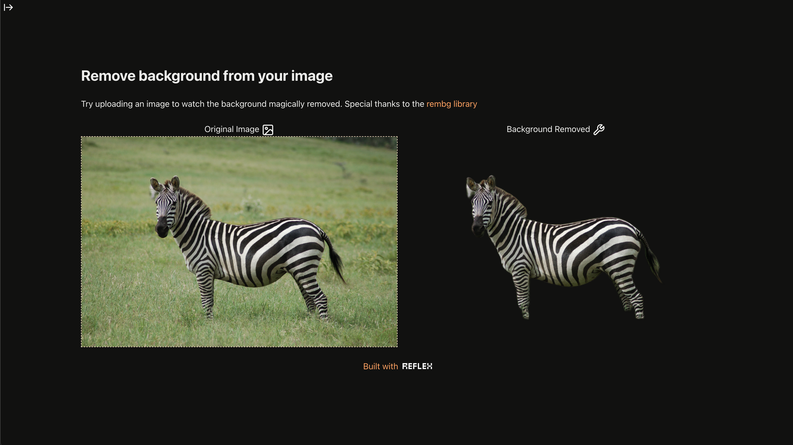

# Background Removal

A Reflex app that removes the background of an image. Inspired from [this](https://github.com/tyler-simons/BackgroundRemoval)

## Demo

## Installation
1. `git clone https://github.com/Lendemor/background-removal`
2. `cd background-removal`
3. `python -m venv .venv`
4. `source .venv/bin/activate`
5. `pip install -r requirements.txt`
6. `reflex run`
